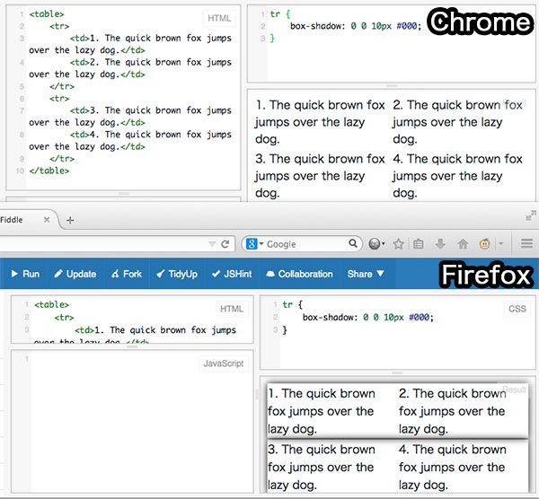
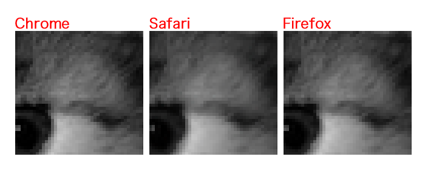

Yokohama.js (#yokohamajs)

## この夏、私が出会ったバグ達

そして、解決するまでの流れ

---

### はじめに

- げこたん [Twitter](http://twitter.com/GeckoTang)  [GitHub](https://github.com/geckotang)
- [株式会社ピクセルグリッド](http://www.pxgrid.com/)
- フロントエンド・エンジニア
- 自称CSSプログラマ
- [CSS Panic](https://developer.mozilla.org/ja/demos/detail/css-panic)
- [惚れさせ男子 for Alfred 2](https://github.com/geckotang/alfred-horesase-workflow)
- [突然のAlfred for Alfred 2](https://github.com/geckotang/alfred-suddendeath-workflow)

---

### ご紹介するバグ達

- 【Chrome】急にカラム落ち
- 【Chrome】trに影がつかない
- 【Safari】汚く縮小された画像

---

## 【Chrome】急にカラム落ち

Mac Chrome 37で発生した。（白いdiv）

------

### バグ発見〜再現コード作成まで

1. floatで、今まで大丈夫だったところが、急にカラム落ちしたという声をTwitterで聞く
2. 「Chrome 37 float」とか「Chrome 37 float bug」でググる。見つからない。
3. 期間を絞り込む。「Chrome 37 float」+「１ヶ月以内」で検索
4. 見つかる。でもまさかのロシア語。[html - Верстка в Google Chrome версии 37](http://hashcode.ru/questions/357493/html-%D0%B2%D0%B5%D1%80%D1%81%D1%82%D0%BA%D0%B0-%D0%B2-google-chrome-%D0%B2%D0%B5%D1%80%D1%81%D0%B8%D0%B8-37)
5. とりあえず、検証用の再現コードを書く。そして[再現](http://jsfiddle.net/2ysf6prx/2/)する。

------

### バグ潰し〜解決(?)

1. 本来であれば、``.cell-3``は``margin-left:-10px;``しているので、親の幅+10pxで330pxになるはず。
2. だが、330pxになっていないため、``.cell-4``は３つ入りきらずにカラム落ちしてしまう。
  1. じゃあ``.cell-3``の幅を[固定値にすればいい](http://jsfiddle.net/2ysf6prx/5/)のでは
  2. ``.cell-3``を[inline-blockにしてみる](http://jsfiddle.net/2ysf6prx/4/)
  3. ``.cell-2``を``float:right:``にして、[全体を囲ってあげる](http://jsfiddle.net/2ysf6prx/3/)
3. とりあえず不安だったら2-1の方法を使うのが良い。と思う。  

------

### 原因と感想

- floatと隣接したボックス内で、clearfixしてるボックスにネガティブマージン使うときに幅がうまいこと算出されない？とかかな？
- そもそも突如発生したバグだし、よくわからないです。
- 誰か知ってたら教えて下さい。
- ロシア語読めないけどコードは読めるよ！

---

## 【Chrome】trに影がつかない

Mac Chrome 37で発生していた（上Chrome,下Firefox）

------

### バグ発見〜再現コード作成まで

1. trにbox-shadowが効かないというTwitterで聞く
2. 「Chrome box-shadow tr」でググる
3. [stackoverflow](http://stackoverflow.com/questions/10874985/box-shadow-on-table-row-not-appearing-in-chrome)で該当の症状を見つける
4. とりあえず検証用の再現コードを書く。そして[再現](http://jsfiddle.net/oa295pyx/)

------

### バグ潰し〜解決(?)

1. stackoverflowでは``tr``を``display:block;``にすれば解決すると書いてある
2. box-shadowは仕様書上では「[すべての要素に対して使える](https://developer.mozilla.org/ja/docs/Web/CSS/box-shadow)」ので、これはChromeとSafariが抱えるバグ。
3. Webkitからのバグなのか...

------

### 原因と感想

- バグです。どうにもなんない。
- ``tr``を``display:block``にできる時もあるしできない時もある。
- デザインとマークアップを見直す。
- いつか治ることを期待しよう。

---

## 【Safari】汚く縮小された画像

Safari 7で発生した。

------

### バグ発見〜再現コード作成まで

1. Safariで600pxの画像を330pxで表示した時にボケるというのを見る
2. とりあえず[検証コード](http://jsfiddle.net/e8vnt4zz/4/)書く
3. 言われてみればぼけてる気もする。[こっちのほうがわかりやすいかも](http://jsfiddle.net/e8vnt4zz/5/)
4. ``image-rendering: optimizeSpeed``とか[してみた](http://jsfiddle.net/e8vnt4zz/6/)けど...うーん。

------

###バグ潰し、原因、そして感想

- ぶっちゃけ誤差レベル。ただ鮮やかな写真とかだと見てわかるかも。
- Safariは小数点の丸め方が他と違うからかな？
- バグというかSafariの画像の縮小方法の違いな気もする
- ``image-rendering``使うのもあんまりよくない
- あまり画像の使い回しをしない...綺麗に割り切れる方が良い。

過去にFirefoxで似たようなこと（[Windows版Firefoxで同一srcの画像が荒れる](http://qiita.com/GeckoTang/items/76d2b29c8e81725db005)）があった

---

## まとめ

- バグを発見したら、とりあえずググる
- ググる時に、期間の絞り込みは有用
- stackoverflowすごい
- バグだということを知ってると後々役に立つ
- 過去の経験を元に推測することも大事

---

### 宣伝

---

#### CodeGrid

「CodeGrid」は、ピクセルグリッドの技術情報配信サービス  
経験豊かなエンジニアと専属編集者の手で、  
確かな情報を定期的にお届けします

- 月額800円（税抜）30日間無料
- 一部の記事は登録なしの無料で読むことができます。  
私の記事：[ここまでできる！HTML＋CSS タイピングゲームを作る](https://app.codegrid.net/entry/derive-html-css-1)

---

## ご清聴ありがとうございました。
